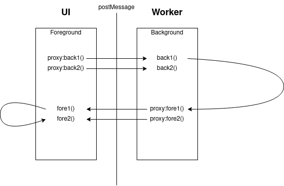

# wwb
Web worker bridge. 

This library's goal is to make working with a web worker as easy as working with any JavaScript module. It aims to handle all of the complexities. You write a module that contains all of the functions you want to run in your worker. Along with all of the functions the worker needs to call in the UI thread. The `Wwb` class wil then build proxy functions for each function. Calling the proxy will invoke the corresponding function on the other side of the worker boundary. The class also starts the worker automatically.

All function are converted to Promises, as their return values must be passed using `postMessage()`. The global init() function is called in the frontend and backend. There is also a `foreground.init()` and `background.init()`. State is NOT shared between foreground and background. While `this` is available, you should take care because foreground and background have separate state.

```javascript
// MyWorker.js

const Wwb = require('wwb.js');


const MyWorker = new Wwb({
  init() {
    // This is called in the frontend and backend.
  },

  foreground: {
    init() {
      // This is called in the foreground.
    },

    async fore1() {
      return await this.fore2();
    },

    async fore2() {
    },
  },

  background: {
    init() {
      // This is called in the background.
    },

    async back1() {
      return await this.fore1();
    },

    async back2() {
    },
  },
});


module.exports = {
    MyWorker,
};
```




To use the above worker, you can include the script in a script tag, or import into your UI code like this:

```javascript
// MyUI.js

const MyWorker = require('MyWorker.js');

// This function will be called directly within your UI thread.
MyWorker
    .fore1()
    .then(console.log)
    .catch(console.error);

// This function will be proxied to the worker thread. The result will be returned as usual,
// and any exception will be re-thrown with the original line number, stack trace etc.
MyWorker
    .back1()
    .then(console.log)
    .catch(console.error);

```

## Limitations / notes.

 - Parameters and return values must be JSON serializable.
 - No memory is shared between the worker and front end. Thus singletons and global instances are not shared.
 - `init()` functions are called on both sides of the barrier, thus state is NOT shared between frontend and backend instances.
